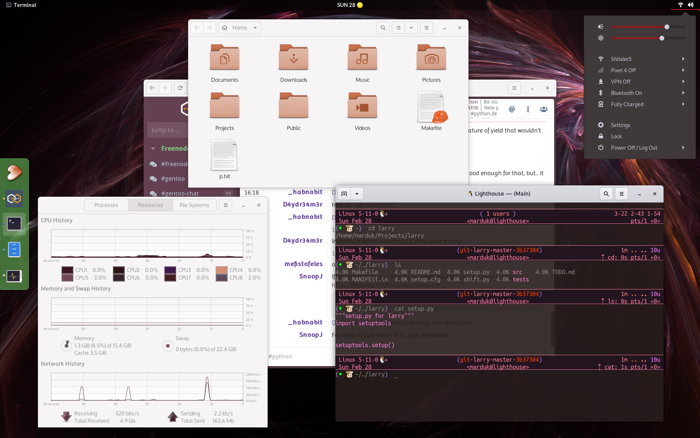
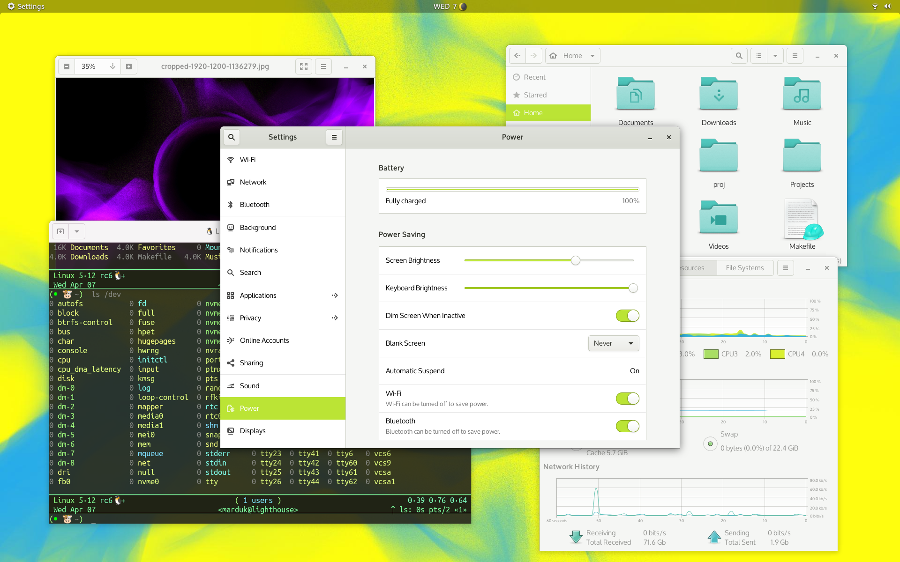

<p align="center">

</p>
<p align="center">

</p>
<br>

## larry

`larry` is a Python script and framework for colorizing your
desktop/terminal. It was originally written to colorize the Larry The
Cow SVG wallpaper, but later developed into pluggable framework for
colorizing lots of things. Included plugins are:

* background: for colorizing the GNOME Desktop background

* gnome_shell: for colorizing a GNOME Shell theme

* gnome_terminal: for colorizing a GNOME Terminal profile

* gtk: for colorizing a GTK+ theme

* vim: for colorizing a vim colorscheme

* command: for running an arbitrary command (build your own)

It should be possible to create your own plugins.  As a reference for creating
a third-party larry plugin, see the
[larry-rgb](https://github.com/enku/larry-rgb) plugin.

Installable via pip:

```console
$ pip install git+https://github.com/enku/larry
```
